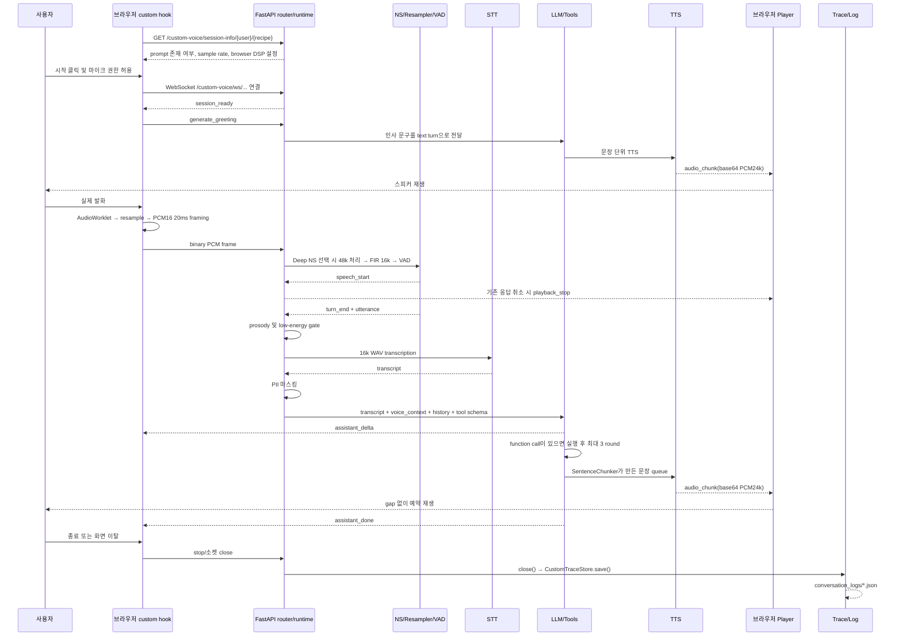

# Custom cascade voice runtime

이 디렉터리는 LiveKit SDK와 OpenAI Realtime API를 사용하지 않고 브라우저 PCM 입력을
STT → LLM/도구 → TTS로 처리하는 독립 음성 런타임이다. 기존 Realtime 구현은 그대로
유지되며, 프론트엔드 환경 변수로 두 구현 중 하나를 선택한다.

이 문서는 다음 두 가지를 동시에 확인하기 위한 구현 지도다.

1. 사용자 발화가 어디서 만들어지고 어떤 함수들을 거쳐 스피커로 출력되는지 추적한다.
2. 정의만 있고 실제 실행 경로에 연결되지 않은 함수, 의도적인 추상화, 테스트·평가 전용
   코드를 구분한다.

## 1. 실행 경로 요약



중요한 실행 순서는 다음과 같다.

```text
브라우저 getUserMedia
  → Browser DSP(none / NS / AEC-only)
  → AudioWorklet Float32
  → StreamingSincResampler
  → PCM16FrameEncoder(20 ms)
  → WebSocket binary PCM
  → NoiseSuppressor
  → AntiAliasResampler(Deep NS일 때 48 → 16 kHz)
  → AdaptiveEnergyEndpointDetector
  → ProsodyExtractor 및 low-energy gate
  → OpenAIHttpProviders.transcribe
  → PIIRedactor.redact
  → OpenAIHttpProviders.stream_chat
  → ToolExecutor.execute 및 LLM 후속 round
  → SentenceChunker
  → OpenAIHttpProviders.synthesize
  → WebSocket audio_chunk
  → decodePCM16
  → enqueuePlayback
  → Web Audio 스피커 출력
  → CustomVoiceRuntime.close
  → CustomTraceStore.save
```

## 2. 애플리케이션 등록과 구현 선택

Custom runtime이 FastAPI와 화면에 연결되는 외부 파일은 다음과 같다.

| 파일 | 실제 역할 |
|---|---|
| `be/routers/__init__.py` | `custom_voice.router.router`를 `all_routers`에 넣는다. |
| `be/main.py` | `all_routers`를 순회하며 FastAPI에 등록한다. |
| `fe/app/src/lib/ai/speech/use-voice-chat.ts` | `VITE_VOICE_IMPLEMENTATION` 값으로 기존 Realtime hook과 custom hook 중 하나를 고른다. |
| `fe/app/src/lib/api.js` | REST 상대 URL과 WebSocket base URL을 만든다. 빈 base URL이면 현재 Vite origin을 사용한다. |
| `fe/app/vite.config.js` | `/custom-voice` WebSocket 및 `/api` REST를 backend로 proxy한다. |
| `be/evaluate_voice_metrics.py` | 저장된 custom trace와 Realtime 로그를 읽어 latency·품질·비용 표를 만든다. |

`fe/app/src/lib/api.js`의 함수도 연결 경로에 포함된다.

| 함수 | Custom runtime과의 관계 |
|---|---|
| `ensureLeadingSlash(path)` | base URL이 없을 때 현재 origin에서 사용할 상대 경로를 `/`로 시작하게 만든다. |
| `buildUrl(base, path)` | 설정된 base URL의 마지막 `/`와 요청 경로를 중복 없이 합친다. |
| `api(path)` | session-info REST 요청 주소를 만든다. Custom hook이 직접 사용한다. |
| `ws(path)` | `absoluteWebSocketUrl()`에 WebSocket base 또는 상대 경로를 제공한다. Custom hook이 직접 사용한다. |
| `get(path, init)` / `post(path, body, init)` | 공용 REST helper지만 현재 Custom hook은 session-info에 직접 `fetch(api(...))`를 사용하므로 Custom 음성 경로에서는 호출되지 않는다. |

선택 변수는 Vite 시작 전에 지정해야 한다.

```dotenv
VITE_VOICE_IMPLEMENTATION=custom_cascade
# VITE_VOICE_IMPLEMENTATION=realtime
```

`fe/app/src/lib/ai/speech/use-voice-chat.ts`의 `VOICE_IMPLEMENTATION`은 위 값을 읽고,
`useVoiceChat` export를 `useCustomCascadeVoiceChat` 또는 `useOpenAIVoiceChat`으로 고정한다.
Vite 환경 변수는 build/dev-server 시작 때 결정되므로 값을 바꾼 뒤 서버를 다시 시작해야 한다.

## 3. 브라우저 입력과 출력 함수

실제 브라우저 구현은
`fe/app/src/lib/ai/speech/custom-cascade/use-voice-chat.custom.ts`에 있다.

### 최상위 helper와 class

| 함수 또는 class | 호출자 | 처리 내용 |
|---|---|---|
| `createBrowserUUID()` | `start()`, `handleServerEvent()` | `crypto.getRandomValues`가 있으면 사용하고 없으면 fallback 난수로 UUID v4를 만든다. 세션·UI message correlation용이며 인증용이 아니다. |
| `absoluteWebSocketUrl(path)` | `start()` | 상대 URL, HTTP URL, WS URL을 현재 origin에 맞는 절대 `ws://` 또는 `wss://` URL로 바꾼다. |
| `StreamingSincResampler.constructor()` | `PCM16FrameEncoder.constructor()` | 브라우저 실제 AudioContext rate와 서버 목표 rate 사이의 비율 및 cutoff를 준비한다. |
| `StreamingSincResampler.push()` | `PCM16FrameEncoder.push()` | 프레임 사이 이력을 유지하며 windowed-sinc 방식으로 streaming resampling한다. |
| `PCM16FrameEncoder.constructor()` | `prepareAudioCapture()` | resampler와 정확한 20 ms 목표 sample 수를 준비한다. |
| `PCM16FrameEncoder.push()` | AudioWorklet `port.onmessage` | Float32 샘플을 resample하고 PCM16으로 바꾼 후 정확한 크기의 `ArrayBuffer` frame들로 반환한다. |
| `decodePCM16()` | `enqueuePlayback()` | 서버의 base64 little-endian PCM16을 Web Audio용 Float32로 복원한다. |
| `useCustomCascadeVoiceChat()` | 공용 `useVoiceChat` selector | 화면이 사용하는 `VoiceChatSession` 상태와 시작·종료·재생·수신 로직 전체를 소유한다. |

### `useCustomCascadeVoiceChat()` 내부 callback/effect

| callback/effect | 직접 호출 계기 | 다음 단계와 side effect |
|---|---|---|
| session-info `useEffect` | hook mount, `userId`/`recipeId` 변경 | `GET /custom-voice/session-info/...`로 recipe 문맥과 오디오 설정을 미리 검증하고 `sessionInfo`에 저장한다. |
| `stopPlayback()` | `playback_stop`, 전체 `stop()` | 예약·재생 중인 `AudioBufferSourceNode`를 모두 중단하고 재생 clock과 speaking 상태를 초기화한다. |
| `enqueuePlayback(event)` | `audio_chunk` 수신 | PCM을 `AudioBuffer`로 만들고 30 ms 여유를 둔 연속 시간축에 예약해 끊김 없이 재생한다. source 종료 때 speaking 상태를 갱신한다. |
| `handleServerEvent(event)` | WebSocket `onmessage` | 아래 protocol 표에 따라 UI message, 재생, timer, theme, URL, 종료 및 오류 상태를 갱신한다. |
| `prepareAudioCapture()` | `start()` | secure context와 `getUserMedia`를 검사하고 서버가 준 browser DSP 설정으로 마이크를 연다. inline `CustomPCMProcessor.process()` AudioWorklet이 channel을 복사해 main thread로 보내고 encoder 결과를 WebSocket으로 전송한다. |
| `startListening()` | 반환된 `VoiceChatSession` API | 기존 microphone track의 `enabled=true`로 빠르게 unmute한다. |
| `stopListening()` | 반환된 `VoiceChatSession` API | track을 닫지 않고 `enabled=false`로 mute한다. |
| `start()` | 화면 시작 버튼 | 마이크를 준비하고 UUID를 만든 뒤 WebSocket을 연다. message/error/close handler도 여기서 연결한다. |
| `stop()` | 화면 종료, server 종료 event, socket 오류/종료, unmount | 서버에 `stop`을 보낸 뒤 socket, timer, playback source, worklet, gain, media track, AudioContext를 모두 정리한다. |
| `stopRef` 갱신 `useEffect` | `stop` callback 변경 | WebSocket callback과 timer callback이 최신 `stop()`을 참조하게 한다. |
| unmount cleanup `useEffect` | 화면 unmount | 비동기 `stop()`을 시작해 마이크와 socket이 남지 않게 한다. |

### Browser DSP 모드

| 설정 | getUserMedia 설정 | 브라우저 전송 | 서버 처리 |
|---|---|---:|---|
| `none` | AEC/NS/AGC off | 16 kHz | passthrough |
| `browser` | AEC + NS + AGC | 16 kHz | passthrough |
| `rnnoise` | AEC + AGC, NS off | 48 kHz | RNNoise → FIR → 16 kHz |
| `deepfilternet` | AEC + AGC, NS off | 48 kHz | DeepFilterNet → FIR → 16 kHz |

Browser NS와 Deep NS는 동시에 켜지지 않는다.

## 4. FastAPI 진입점: `router.py`

| 함수/객체 | 호출 경로 | 역할 |
|---|---|---|
| `router` | `be/routers/__init__.py` | 기존 `/assistant/openai-realtime`과 겹치지 않는 `/custom-voice` namespace를 만든다. |
| `_normalize_session_id(value)` | `custom_voice_websocket()` | 외부 session ID를 UUID hex로 제한하고 없으면 새 UUID를 만든다. 로그 파일명 주입도 차단한다. |
| `_load_context(user_id, recipe_id)` | 두 route handler | DB session을 열어 `build_session_context()`를 호출하고 `finally`에서 닫는다. |
| `get_custom_voice_session_info()` | 브라우저 session-info fetch | recipe/prompt 존재 여부와 protocol, NS mode, sample rate, browser constraints를 반환한다. Python 직접 호출이 없어도 FastAPI decorator로 연결된 실제 HTTP entrypoint다. |
| `custom_voice_websocket()` | 브라우저 WebSocket | context·settings·runtime을 만들고 `runtime.run()`으로 제어를 넘긴다. handshake 전 오류는 JSON `error` 후 code 1011로 종료한다. |

## 5. 세션 문맥과 설정

### `config.py`

| class/함수 | 역할 |
|---|---|
| `CustomVoiceSettings` | 한 세션의 sample rate, VAD, endpoint, NS, STT/LLM/TTS 모델과 timeout을 보관한다. |
| `transport_sample_rate` | RNNoise/DeepFilterNet이면 48 kHz, 아니면 16 kHz를 반환한다. 브라우저와 서버 handshake의 전송 규격이다. |
| `browser_audio_constraints` | `none`, `browser`, deep NS에 맞춰 AEC/NS/AGC 중복을 막는 설정을 만든다. |
| `from_env()` | `CUSTOM_VOICE_*` 환경 변수를 검증·형변환해 immutable settings를 만든다. 세션 생성 때 호출된다. |

### `context.py`

| 함수 | 역할 |
|---|---|
| `build_session_context(db, user_id, recipe_id)` | recipe, 단계, 사용자 알레르기와 도구 사용 가능 여부를 DB에서 읽는다. 단계 번호·시간과 안전 지침, tool 사용 규칙을 system prompt로 만들고 `system_prompt`, `recipe_name`, `steps`, `safety`를 반환한다. |

### `privacy.py`

| class/함수 | 역할 |
|---|---|
| `PIIRedactor` | 주민등록번호, 전화번호, 이메일, 카드번호 정규식을 보관한다. |
| `PIIRedactor.redact(text)` | STT/text 입력이 LLM history와 로그로 들어가기 전에 PII를 의미 토큰으로 치환한다. 외부 STT로 보내는 원본 음성 자체는 가리지 못한다. |

## 6. 입력 음성 분석: `audio.py`

| class/함수 | 호출자 | 역할 |
|---|---|---|
| `AudioEvent` | detector | `speech_start` 또는 `turn_end`와, 종료 시 전체 utterance·duration을 전달한다. |
| `AdaptiveEnergyEndpointDetector.__init__()` | `CustomVoiceRuntime.__init__()`, 평가 | 30 ms frame 크기, pre-roll, speech buffer, noise floor와 VAD 상태를 준비한다. |
| `talking` | 평가와 테스트 | 현재 발화 구간인지 읽기 전용으로 제공한다. |
| `reset()` | 현재 runtime 호출 없음 | 연결을 유지한 채 VAD의 pending/pre-roll/speech/state를 초기화할 수 있는 공개 utility다. 미사용 감사 항목은 아래 표에 별도 표시한다. |
| `push(pcm)` | runtime `_handle_audio()`, `vad_metrics()` | 임의 크기 PCM 조각을 30 ms frame으로 정렬하고 발생한 event 목록을 반환한다. |
| `_process_frame(frame)` | `push()` | adaptive noise floor와 RMS threshold로 voiced 여부를 판단한다. 연속 speech면 `speech_start`, 침묵 또는 최대 길이에 도달하면 `turn_end`를 만든다. |
| `ProsodyMetadata` | extractor/runtime | pitch, RMS, pace, emotion, urgency를 낮은 cardinality로 보관한다. |
| `ProsodyMetadata.prompt_hint()` | `_respond()` | LLM user content 앞에 붙일 제한된 `[voice_context ...]` 문자열을 만든다. |
| `ProsodyExtractor.__init__()` | runtime | 분석 sample rate를 보관한다. |
| `ProsodyExtractor.extract(pcm)` | `_process_audio_turn()` | RMS, zero-crossing 기반 pace/urgency, autocorrelation pitch를 계산한다. low-energy gate에도 이 RMS가 사용된다. |
| `_estimate_pitch(samples)` | `extract()` | 중앙 최대 80 ms의 autocorrelation peak로 대략적인 F0를 계산한다. |

## 7. 노이즈 억제와 리샘플링: `noise_suppression.py`

### 공통 계약과 통계

| class/함수 | 호출자 | 역할 |
|---|---|---|
| `NoiseSuppressionError` | 모든 NS 구현, runtime/router | 노이즈 처리 경계의 공통 오류다. |
| `NoiseSuppressorUnavailable` | RNNoise/DeepFilterNet loader | 선택한 native backend가 설치되지 않았거나 상태가 닫혔음을 나타낸다. |
| `AudioFrame` | runtime/evaluator | PCM과 sample rate, sequence, sample index, timestamp를 함께 운반한다. |
| `AudioFrame.samples` | runtime/stat | PCM16 byte 수를 sample 수로 바꾼다. |
| `AudioFrame.duration_ms` | `NoiseSuppressionStats.record()` | 프레임 음성 길이를 계산한다. |
| `NoiseSuppressionStats.record()` | passthrough와 measured suppressor | frame 수, audio time, wall time, CPU time, 최대 frame latency를 누적한다. |
| `NoiseSuppressionStats.summary()` | runtime `close()`, evaluator | 평균 처리시간, RTF, 처리 중 CPU%, 실패 수를 JSON 가능한 값으로 만든다. |
| `NoiseSuppressor.process()/close()` | runtime/evaluator가 다형적으로 호출 | 구현 교체를 위한 `Protocol` 선언이다. 함수 본체가 비어 보여도 실행용 그림자 함수가 아니라 type contract다. |

### 구현별 함수

| class/함수 | 실제 경로 | 역할 |
|---|---|---|
| `PassthroughNoiseSuppressor.__init__()` | `none`, `browser` factory branch | 실제 PCM은 바꾸지 않고 선택 mode를 통계에 남긴다. |
| `PassthroughNoiseSuppressor.process()` | runtime/evaluator | 무처리 지연시간을 기록하고 같은 frame을 반환한다. Browser DSP는 이미 브라우저에서 적용됐다. |
| `PassthroughNoiseSuppressor.close()` | runtime/evaluator 종료 | 외부 자원이 없어 no-op이다. |
| `_MeasuredSuppressor.__init__()` | RNNoise/DeepFilterNet 상속 | 구현 mode의 통계를 준비한다. |
| `_MeasuredSuppressor.process()` | runtime/evaluator | `_process_sync()`를 `asyncio.to_thread`로 보내 event loop blocking을 막고 wall/CPU/failure를 기록한다. |
| `_MeasuredSuppressor._process_sync()` | subclass override | Template Method용 의도적인 `NotImplementedError` 지점이다. base class를 직접 만들지 않는다. |
| `_MeasuredSuppressor.close()` | DeepFilterNet 종료 | 기본 no-op이며 RNNoise만 override한다. |
| `RNNoiseSuppressor.__init__()` | factory 또는 테스트 | 테스트 주입 processor가 없으면 `_load_library()`를 호출한다. |
| `_load_library()` | RNNoise 생성 | DLL/SO를 찾고 ctypes C ABI와 denoising state를 초기화한다. |
| `_process_native_block()` | RNNoise `_process_sync()` | 480 sample block을 주입 processor 또는 `rnnoise_process_frame`으로 처리한다. |
| `RNNoiseSuppressor._process_sync()` | inherited `process()` | 48 kHz와 480 sample 배수를 검증하고 block별 처리 후 PCM16으로 복원한다. |
| `RNNoiseSuppressor.close()` | session/evaluation 종료 | native state를 destroy하고 참조를 해제한다. |
| `DeepFilterNetSuppressor.__init__()` | factory 또는 테스트 | 모델 경로와 선택적 processor만 저장해 무거운 로딩을 미룬다. |
| `_load_model()` | 첫 `_process_sync()` | 공식 `df.enhance`와 모델을 한 번만 로딩하고 내부 processor closure를 만든다. |
| `process_with_official_package()` | `_load_model()`이 만든 closure | PCM 범위를 tensor로 정규화하고 `enhance()` 후 PCM 범위로 되돌린다. |
| `DeepFilterNetSuppressor._process_sync()` | inherited `process()` | 48 kHz 입력·출력 길이를 검증하고 processor 결과를 PCM16으로 복원한다. |
| `AntiAliasResampler.__init__()` | runtime/evaluator | 정수 배율을 검증하고 48→16 kHz 변환용 low-pass FIR kernel과 frame history를 만든다. 같은 rate면 factor 1이다. |
| `AntiAliasResampler.process()` | runtime `_handle_audio()`, 평가 `_process_audio()` | 이전 frame history를 이어 filtering한 후 decimation하며 correlation metadata를 보존한다. |
| `create_noise_suppressor()` | runtime/evaluator | mode에 따라 passthrough, RNNoise, DeepFilterNet 중 정확히 하나를 생성한다. 선택하지 않은 optional dependency는 import하지 않는다. |

RNNoise 환경 변수:

```dotenv
CUSTOM_VOICE_NOISE_SUPPRESSION=rnnoise
CUSTOM_VOICE_RNNOISE_LIBRARY=C:\path\to\rnnoise.dll
```

DeepFilterNet 선택 의존성 설치:

```powershell
pip install -r requirements-noise-suppression.txt
```

## 8. 세션 orchestration: `runtime.py`

### 상태와 문장 분할

| class/함수 | 역할 |
|---|---|
| `SessionState` | `connecting`, `listening`, `user_speaking`, `thinking`, `agent_speaking`, `interrupted`, `closed` 상태의 source of truth다. |
| `SentenceChunker.__init__()` | 최소·최대 문장 길이와 delta buffer를 준비한다. |
| `SentenceChunker.feed(delta)` | LLM text delta를 누적하고 완성된 TTS 문장만 반환한다. |
| `SentenceChunker.flush()` | LLM round 종료 뒤 남은 text를 마지막 TTS chunk로 꺼낸다. |
| `SentenceChunker._find_boundary()` | 최소 길이 이후 문장부호를 찾고, 최대 길이를 넘으면 공백 또는 강제 위치로 자른다. |

### `CustomVoiceRuntime` 함수별 실제 호출 관계

| 함수 | 호출자 | 처리 및 다음 단계 |
|---|---|---|
| `__init__()` | WebSocket route | detector, suppressor, resampler, prosody, redactor, providers, trace, tools와 LLM history를 세션별로 만든다. 생성 시 provider key와 선택 NS backend도 검증된다. |
| `run()` | `custom_voice_websocket()` | socket accept → 시작 로그 → `session_ready` → `LISTENING` 후 binary/text 수신 loop를 돈다. disconnect 또는 loop 종료 시 반드시 `close()`한다. |
| `close()` | `run()` finally, 중복 종료 경로 | 진행 응답 취소 → active turn 확정 → NS close/stat 저장 → provider close → `trace.save()` → CLOSED 순으로 한 번만 실행한다. |
| `_handle_control(raw_message)` | `run()` text branch | `ping`, `stop`, `text`, `timer_complete`, `generate_greeting`을 처리한다. text 계열은 `_begin_text_turn()`으로 간다. |
| `_handle_audio(pcm)` | `run()` binary branch | `AudioFrame` 생성 → NS → resampler → detector. `speech_start`면 barge-in 및 trace 시작, `turn_end`면 `_process_audio_turn()` task를 만든다. NS 오류 뒤에는 추가 frame을 무시한다. |
| `_begin_text_turn(text, internal)` | greeting/text/timer control | 기존 응답 중단 → 음성 없는 trace 생성 → STT 완료 시각 즉시 기록 → PII 처리 → `_respond()` task. greeting은 user log에 남기지 않는다. |
| `_interrupt_active_response()` | 새 speech/text turn | 기존 response/TTS task를 cancel하고 interruption timestamp를 확정한 뒤 브라우저에 `playback_stop`을 보낸다. |
| `_process_audio_turn(pcm, trace)` | VAD `turn_end` task | `ProsodyExtractor.extract()`를 먼저 실행한다. RMS가 작으면 STT 없이 종료하고, 통과하면 `transcribe()` → PII → user log/UI transcript → `_respond()` 순서로 진행한다. 현재 prosody와 STT는 병렬이 아니라 순차다. |
| `_respond(transcript, prosody, trace)` | audio/text turn | TTS worker를 만들고 user history에 voice context를 추가한다. 최대 3회의 LLM/tool round를 돌며 text는 UI와 TTS queue로 fan-out한다. 완료 시 assistant log, turn 확정, `assistant_done`, LISTENING을 보낸다. cancel/error면 TTS도 정리한다. |
| `_stream_one_llm_round()` | `_respond()` | provider SSE에서 usage, text delta, 분할된 function 이름/arguments를 조립한다. 첫 token timestamp를 기록하고 text를 `assistant_delta`와 TTS queue에 동시에 보낸다. |
| `_execute_tools()` | `_respond()`의 tool branch | 한 round의 tool call을 `asyncio.gather`로 병렬 실행한다. 결과를 LLM history의 tool message와 trace에 추가해 다음 LLM round가 읽게 한다. |
| `_execute_tools()` 내부 `execute_one()` | `_execute_tools()`의 `asyncio.gather` | streaming으로 조립된 JSON arguments를 파싱하고 tool 하나를 `ToolExecutor.execute()`에 전달해 `(call, execution)`을 반환한다. |
| `_tts_worker(queue, trace)` | `_respond()`가 생성 | 문장을 순서대로 `synthesize()`하고 첫 audio timestamp/state를 기록한다. PCM을 base64 `audio_chunk`로 보내며 전체 agent audio duration을 누적한다. |
| `_fail_turn()` | audio/LLM/TTS 예외 경로 | turn을 닫고 서버 로그와 client `error`를 남긴 뒤 LISTENING으로 복구한다. |
| `_set_state(state)` | 모든 상태 전이 | 같은 상태는 무시하고 trace entry와 `state_changed` event를 함께 발행한다. |
| `_send_json(payload)` | runtime 및 `ToolExecutor` callback | 단일 `asyncio.Lock`으로 동시 WebSocket JSON write를 직렬화한다. |

### Barge-in 경로

```text
사용자 새 발화
  → VAD speech_start
  → _interrupt_active_response
  → LLM/TTS task cancel
  → 기존 turn interruption timestamp 확정
  → playback_stop
  → 브라우저 stopPlayback
  → 새 TurnTrace 시작
```

## 9. 외부 모델 연결: `providers.py`

| class/함수 | 호출자 | 역할 |
|---|---|---|
| `ProviderError` | provider 함수 | HTTP 상태, SSE JSON, TTS body 계약 위반을 runtime 공통 오류로 전달한다. |
| `OpenAIHttpProviders.__init__()` | runtime, noise evaluator | 주입 client가 있으면 테스트/호환 서버 경계로 사용한다. 아니면 `OPENAI_API_KEY`, base URL, timeout으로 `httpx.AsyncClient`를 만든다. |
| `close()` | runtime/evaluator | provider가 직접 만든 keep-alive client만 닫는다. 주입 client의 lifecycle은 호출자가 소유한다. |
| `transcribe(pcm)` | `_process_audio_turn()`, noise evaluator | `_pcm_to_wav()` 후 `/audio/transcriptions`에 model과 한국어 설정으로 전송하고 text를 반환한다. |
| `stream_chat(messages, tools)` | `_stream_one_llm_round()` | `/chat/completions` streaming 요청을 보내고 `data:` SSE frame을 JSON 단위로 yield한다. 최종 usage도 포함한다. |
| `synthesize(text)` | `_tts_worker()` | `/audio/speech`에 문장과 voice를 보내 24 kHz raw PCM을 받는다. JSON/text 응답, 빈 body, 홀수 PCM byte를 오류로 차단한다. |
| `_pcm_to_wav(pcm, sample_rate)` | `transcribe()` | header 없는 mono PCM16을 메모리 WAV container로 감싼다. |

기본 모델은 다음과 같다.

```dotenv
CUSTOM_VOICE_STT_MODEL=gpt-4o-mini-transcribe
CUSTOM_VOICE_LLM_MODEL=gpt-4.1-mini
CUSTOM_VOICE_TTS_MODEL=gpt-4o-mini-tts-2025-12-15
CUSTOM_VOICE_TTS_VOICE=alloy
CUSTOM_VOICE_PROVIDER_TIMEOUT=45
```

## 10. Function tools: `tools.py`

| 항목 | 역할 |
|---|---|
| `TOOL_SCHEMAS` | LLM에 전달되는 OpenAI 호환 function schema 목록이다. 문자열 이름이 `ToolExecutor.execute()` branch와 일치해야 한다. |
| `ToolExecution` | result, duration, success를 묶어 LLM history와 trace에 전달한다. |
| `ToolExecutor.__init__()` | runtime의 `_send_json` callback을 받아 browser side effect event를 보낼 수 있게 한다. |
| `ToolExecutor.execute(name, arguments)` | allowlist 이름별 인자를 검증하고 UI event 또는 MCP call을 수행한다. 실패도 exception으로 끊지 않고 `{success:false}` tool result로 LLM에 돌려준다. |

`execute()` 내부 이름별 경로:

| Tool 이름 | 실제 동작 |
|---|---|
| `navigate_cooking_step` | `assistant_event/navigate_step`을 브라우저로 보내 다음·이전·지정 단계 이동을 요청한다. |
| `start_timer` | `assistant_event/timer_start`을 보내 브라우저 timer를 시작한다. 만료되면 브라우저가 `timer_complete` control을 서버에 되돌린다. |
| `send_video_url` | step을 검증하고 `assistant_event/video`를 보낸다. 현재 `data`는 빈 문자열이며 상위 화면 callback이 step을 기준으로 처리한다. |
| `changeBrowserTheme` | light/dark를 검증하고 `assistant_event/theme`을 보낸다. custom hook이 `documentElement.dataset.theme`을 바꾼다. |
| `web_search` | 공용 MCP manager의 `tavily-remote-mcp/search`를 호출한다. |
| `open_coupang` | URL encode한 Coupang 검색 주소를 만들고 `assistant_event/open_url`을 보낸다. |
| `searchFoodNutrition` | 공용 MCP manager의 `k-mfds-fooddb/searchFoodNutrition`을 호출한다. |
| `endConversation` | `assistant_event/end_conversation`을 보내 브라우저 `stop()`을 호출한다. |

## 11. Trace와 로그: `tracing.py`

| class/함수 | 호출자 | 역할 |
|---|---|---|
| `TurnTrace` | runtime | 한 사용자 turn의 speech/STT/token/audio/완료/interrupt timestamp, token 수, transcript, prosody, tool call을 보관한다. |
| `CustomTraceStore.__init__()` | runtime 생성 | 세션 식별자, system prompt, 시작 시각, turn/entry/runtime metric 저장소와 로그 경로를 준비한다. |
| `active_turn` | runtime | 현재 처리 중인 turn을 읽기 전용으로 노출한다. |
| `start_turn()` | speech/text turn 시작 | turn ID와 speech ID, speech start timestamp를 가진 active `TurnTrace`를 만든다. 아직 완료 목록에는 넣지 않는다. |
| `finish_turn()` | 정상 완료, 오류, interrupt, close | active turn을 순서가 보존된 완료 목록에 정확히 한 번 넣고 active를 비운다. |
| `add_entry()` | state, user, assistant, tool, VAD reject | UTC timestamp 및 metadata와 함께 사람이 읽는 대화/event log를 메모리에 추가한다. |
| `save()` | `CustomVoiceRuntime.close()` | 완료 turn을 공용 `VoiceMetricsTracker` 형식으로 변환해 summary를 계산한다. 원본 trace와 runtime NS 통계를 포함한 JSON을 안전한 파일명으로 `be/conversation_logs`에 기록한다. |

`save()`는 WebSocket을 정상 종료하거나 연결이 끊겨 `run()`의 `finally`에 들어갈 때 호출된다.
평가하려면 세션 종료 버튼을 눌러 socket을 닫는 것이 가장 확실하다.

## 12. WebSocket protocol 전체 목록

### 브라우저 → 서버

| 메시지 | 서버 처리 |
|---|---|
| binary PCM16 frame | `run()` → `_handle_audio()` |
| `{"type":"generate_greeting"}` | `_handle_control()` → 내부 text turn → LLM/TTS |
| `{"type":"timer_complete", ...}` | `_handle_control()` → 일반 text turn |
| `{"type":"text", ...}` | `_handle_control()` → 일반 text turn. 현재 custom hook은 직접 text 전송 API를 노출하지 않아 확장용 경로다. |
| `{"type":"ping"}` | 서버가 `pong`으로 응답한다. 현재 custom hook에는 heartbeat 송신이 없다. |
| `{"type":"stop"}` | 수신 loop를 끝내고 `close()` 및 trace 저장으로 간다. |

### 서버 → 브라우저

| Event | `handleServerEvent()` 처리 |
|---|---|
| `session_ready` | active/listening 설정 후 greeting 요청 |
| `user_speech_started` | 미완료 user message 생성, speaking=true |
| `user_speech_ended` | speaking=false |
| `user_transcript` | user message text 확정 |
| `assistant_delta` | assistant message 생성 또는 text 이어 붙이기 |
| `audio_chunk` | `enqueuePlayback()`으로 PCM 예약 재생 |
| `assistant_done` | assistant text message 완료 표시 |
| `playback_stop` | 모든 예약·재생 audio 중단 |
| `assistant_event` | theme/open URL/end/timer를 hook에서 처리하고 나머지는 `props.onAssistantEvent`로 넘김 |
| `error` | console과 React error 상태에 저장 |
| `state_changed` | 서버 trace/관측용으로 발행되지만 현재 switch에는 전용 case가 없어 UI에서 무시됨 |
| `empty_transcript` | VAD low-energy 또는 빈 STT 결과를 알리지만 현재 switch에는 전용 case가 없어 UI에서 무시됨 |
| `pong` | 현재 hook이 ping을 보내지 않으며 전용 case도 없음 |

`assistant_done`은 서버가 TTS PCM을 모두 전송했다는 뜻이다. 실제 브라우저 speaker 재생 종료는
각 `AudioBufferSourceNode.onended`가 별도로 판단한다.

## 13. 노이즈 억제 평가: `noise_evaluation.py`

이 파일은 실시간 WebSocket runtime에서 호출되지 않는다. `evaluate_voice_metrics.py`의
`--mode noise-suppression` 전용 offline corpus 경로이며, runtime과 동일한 suppressor와
resampler를 재사용해 그림자 구현이 생기지 않게 한다.

| 항목 | 역할 |
|---|---|
| `REQUIRED_NOISE_CATEGORIES` | cafe/crowd, keyboard, fan/air conditioner, street, TV, background conversation, baby, dog, construction/transient의 필수 label 집합이다. |
| `EXPERIMENT_CONFIGS` | 실험 이름을 `none`, `browser`, `rnnoise`, `deepfilternet` runtime mode로 연결한다. |
| `CorpusItem` | clean/noisy WAV, browser NS capture, transcript, speech segment, entity/number 정답을 묶는다. |
| `load_manifest()` | JSONL을 읽고 경로를 해석하며 필수 noise category 누락을 검사한다. 내부 `resolve()`는 상대 WAV 경로를 manifest 위치 기준으로 바꾼다. |
| `_read_pcm16_wav()` | mono PCM16 WAV만 허용하고 PCM과 rate를 반환한다. |
| `_edit_distance()` | WER/CER용 Levenshtein 거리를 계산한다. |
| `text_metrics()` | WER, CER, entity accuracy, numeric accuracy를 계산한다. 내부 `recall()`은 공백·대소문자를 정규화한다. |
| `vad_metrics()` | reference segment와 frame별 detector 상태를 비교해 VAD FP/FN, false/missed endpoint, false interruption proxy를 계산한다. |
| `signal_metrics()` | clean과 enhanced 사이 SNR을 계산하고 설치되어 있으면 PESQ/STOI도 계산한다. |
| `_process_audio()` | corpus PCM을 runtime과 같은 factory → suppressor → resampler 순서로 처리하고 NS 실행 통계를 반환한다. |
| `_mean()` | 성공 record의 존재하는 metric만 평균 낸다. |
| `run_noise_suppression_benchmark()` | 모든 corpus/config 조합을 처리한다. 선택적으로 실제 STT를 호출하고 품질·VAD·실행비용·clean distortion을 item/summary로 반환한다. provider는 `finally`에서 닫는다. |
| `print_noise_summary()` | configuration별 downstream 품질과 runtime cost 표를 출력한다. 내부 `value()`는 값 또는 `-`를 포맷한다. |

`browser_ns`의 CPU/latency는 browser process 밖에서 이미 처리된 WAV만으로 알 수 없으므로
0이 아니라 `None`으로 저장한다.

실행 예:

```powershell
python be/evaluate_voice_metrics.py --mode noise-suppression `
  --corpus-manifest be/data/noise_corpus/manifest.jsonl
```

## 14. 실행 코드가 아닌 파일

| 파일 | 상태 |
|---|---|
| `__init__.py` | package 설명과 import 경계만 제공한다. 실행 함수가 없다. |
| `livekit_prompt.txt` | 초기 설계 검토 원문이다. Python import, FastAPI 등록, runtime 호출 경로 어디에도 연결되지 않는다. 운영 코드가 아니다. |
| `README.md` | 현재 문서이며 실행되지 않는다. |

## 15. 미사용·그림자 구현 감사 결과

정적 검색으로 정의와 참조를 대조한 결과다. 동적 route/tool 이름은 decorator와 문자열 dispatch까지
포함해 판단했다.

| 후보 | 판정 | 근거와 조치 |
|---|---|---|
| `AdaptiveEnergyEndpointDetector.reset()` | 현재 직접 호출 없음 | runtime은 세션 동안 같은 detector를 계속 사용하고 endpoint에서 내부 발화 상태만 정리한다. 연결 유지 중 강제 reset 기능을 위한 utility지만 현재 필요하지 않다면 삭제 후보로 검토할 수 있다. |
| `startListening()` / `stopListening()` | 현재 저장소 내 직접 consumer 없음 | 공용 `VoiceChatSession` 계약과 Realtime hook 호환을 위해 반환된다. `start()`는 처음부터 listening을 켜고 `stop()`은 전체 자원을 닫으므로 현재 화면에서는 별도 mute API를 사용하지 않는다. |
| `_handle_control()`의 `text` branch | 현재 custom hook 송신 없음 | timer/greeting은 사용 중이고 일반 text control만 확장용이다. text input UI를 붙이지 않을 계획이면 축소 후보다. |
| `_handle_control()`의 `ping` 및 client `pong` | 현재 heartbeat 없음 | protocol 확장용이다. 네트워크 keepalive를 구현하지 않을 경우 제거 후보다. |
| `state_changed` event | 서버 발행, client 전용 case 없음 | trace에는 의미가 있으나 UI는 다른 event로 상태를 갱신한다. UI FSM의 단일 source로 쓸 계획이 없다면 WebSocket 발행은 중복 후보다. |
| `empty_transcript` event | 서버 발행, client 전용 case 없음 | 서버는 정상 복구하지만 화면 안내는 표시되지 않는다. 제거보다는 client case를 추가해 “다시 말해 달라”는 UX를 제공하는 편이 적절하다. |
| `NoiseSuppressor` Protocol method | 의도적인 추상 계약 | 구현 본체가 없어도 runtime의 타입 경계이므로 그림자 함수가 아니다. |
| `_MeasuredSuppressor._process_sync()` | 의도적인 template method | RNNoise와 DeepFilterNet이 override하며 inherited `process()`가 동적으로 호출한다. |
| injected RNNoise/DeepFilterNet processor | 테스트·최적화 경계 | 기본 운영 경로는 native library/package를 쓰고, 주입 경로는 단위 테스트와 향후 streaming binding에 사용된다. |
| FastAPI route handler | 실제 HTTP/WebSocket entrypoint | Python 내 직접 호출이 없어도 decorator와 router 등록으로 실행된다. 그림자 함수가 아니다. |
| `noise_evaluation.py` helper | CLI 평가 전용 | 실시간 runtime에서는 호출되지 않지만 evaluator entrypoint에서 전부 연결된다. |
| `ToolExecutor.execute()`의 각 tool branch | LLM 문자열 dispatch | 정적 Python 호출이 보이지 않아도 `TOOL_SCHEMAS` 이름과 LLM function call로 도달한다. |
| `PassthroughNoiseSuppressor` | 실제 none/browser 경로 | browser NS는 브라우저에서 끝나므로 서버 no-op이 올바른 구현이다. 그림자 처리가 아니다. |

현재 확인된 가장 명확한 완전 미사용 함수는 `AdaptiveEnergyEndpointDetector.reset()`이다.
나머지는 호환 API, protocol 확장점, 추상화 또는 평가·테스트 경계다. 서버가 발행하지만 브라우저가
명시적으로 소비하지 않는 `state_changed`, `empty_transcript`, `pong`은 함수보다 protocol 수준의
불일치 후보이므로 향후 정리 시 우선 확인해야 한다.

## 16. 실행과 실제 로그 평가

Backend:

```powershell
cd be
python -m uvicorn main:app --host 127.0.0.1 --port 8000
```

Frontend custom mode:

```powershell
cd fe/app
$env:VITE_VOICE_IMPLEMENTATION="custom_cascade"
npm run dev
```

WebSocket 종료 후 로그는 다음 위치에 저장된다.

```text
be/conversation_logs/YYYYMMDD_HHMMSS_custom_cascade_<session-id>.json
```

실제 로그의 latency와 비용 평가:

```powershell
cd be
python evaluate_voice_metrics.py `
  --mode analyze-logs `
  --architecture custom_cascade `
  --output-dir evaluation_results
```

합성 wiring 비교는 실제 모델이나 마이크를 호출하지 않는다.

```powershell
python evaluate_voice_metrics.py --mode compare --architecture both --output-dir evaluation_results
```
